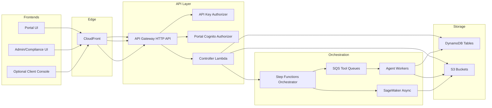
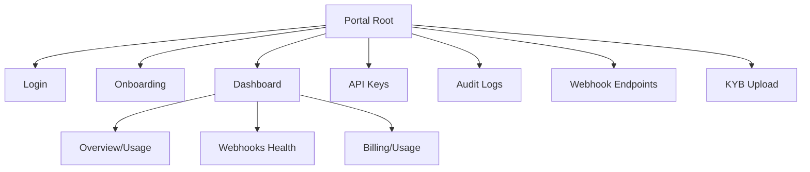

# Complete Frontend Spec (KYC Multimodal)

Status: evidence-based, repo-only. All unknowns are flagged with TODO/UNKNOWN and include where to confirm.

## Table of Contents
1. System and Frontend Architecture
2. Auth, Login, and Security Logic
3. Screen-by-Screen Build Spec
4. Dashboards and Graphs
   4.3 Dashboard Inventory and Authority-Based Visibility
5. Observability and Troubleshooting
6. Environments and Deployment
7. Appendices
   7.3 Key Findings / Gaps
8. Related Handoff Docs

---

## 1. System and Frontend Architecture

### 1.1 Frontends implied by backend/infra
Evidence shows three distinct access modes:
- Portal UI for Cognito users (`/portal/*` routes) and onboarding (Cognito authorizer). Source: `kyc-infra-main/cdktf/src/backend/controller/index.ts:76`.
- Data-plane API clients using API keys (`/jobs`, `/uploads/presign`, etc.). Source: `kyc-infra-main/cdktf/src/backend/controller/index.ts:197`.
- Admin/control-plane actions gated by admin token + admin scope (`/tenants`, `/plans/*`, `/risk/*`, compliance holds). Source: `kyc-infra-main/cdktf/src/backend/controller/index.ts:226` and `kyc-infra-main/cdktf/src/backend/controller/context.ts:94`.

Frontend deliverables implied by the above:
- **Portal (Client/Partner UI):** tenant onboarding, KYB upload, stats, billing, API key self-service, audit logs, webhook management. Source: `kyc-infra-main/cdktf/src/constructs/api/index.ts:381`.
- **Admin/Compliance Console (Internal):** tenant creation, plan management, billing top-ups, KYB status updates, risk override, compliance holds, control-plane events. Source: `kyc-infra-main/cdktf/src/constructs/api/index.ts:405`.
- **Optional API Client Console:** job creation and job detail (data-plane). Source: `kyc-infra-main/cdktf/src/backend/controller/index.ts:203`.

Frontend repo status (resolved): No UI repo exists in workspace. Evidence: only `kyc-infra-main/cdktf/package.json` and no TSX/JSX/HTML app files found. Search evidence: `rg --files -g "package.json" -g "*.tsx" -g "*.jsx" -g "*.html"`.

### 1.2 FE hosting architecture (evidence)
- Portal UI is hosted via S3 + CloudFront, with SPA 403/404 -> index.html routing. Source: `kyc-infra-main/cdktf/src/constructs/edge/index.ts:208`.
- UI bucket name pattern: `${prefix}-portal-ui`. Source: `kyc-infra-main/cdktf/src/constructs/storage/index.ts:102`.
- UI URL output is `ui_url` from stack outputs. Source: `kyc-infra-main/cdktf/src/stacks/dev.ts:297`.

Decision: FE framework default is Vite SPA (with Next.js as supported alternative). See `docs/adr/0001-frontend-framework.md`.

### 1.3 High-level architecture diagram

Evidence: API Gateway + Lambda routes in `kyc-infra-main/cdktf/src/constructs/api/index.ts:296`, Step Functions in jobs route `kyc-infra-main/cdktf/src/backend/controller/routes/jobs.ts:165`, agent workers via SQS runner `kyc-agents-main/common/sqs_runner.py:113`.

---

## 2. Auth, Login, and Security Logic

### 2.1 Portal user auth (Cognito)
- Cognito User Pool and client configured for OAuth code flow and password/SRP auth. Source: `kyc-infra-main/cdktf/src/constructs/auth/index.ts:19`.
- Explicit auth flows include refresh token auth: `ALLOW_REFRESH_TOKEN_AUTH`. Source: `kyc-infra-main/cdktf/src/constructs/auth/index.ts:57`.
- Callback URLs include `http://localhost:3000/api/auth/callback/cognito` (dev) and `https://portal.reagvis.com/api/auth/callback/cognito` (prod). Source: `kyc-infra-main/cdktf/src/constructs/auth/index.ts:70`.
- Portal authorizer expects Authorization: Bearer <Cognito ID token> and enforces origin header. Source: `kyc-infra-main/cdktf/src/backend/auth/portal-authorizer.ts:21`.
- Authorizer uses ID tokens (tokenUse: "id"). Source: `kyc-infra-main/cdktf/src/backend/auth/portal-authorizer.ts:12`.

Hosted UI ownership (resolved): No Cognito UserPoolDomain configured in repo. Decision: use Cognito Hosted UI with Authorization Code + PKCE and add domain in infra. See `docs/adr/0002-auth-flow-cognito-pkce.md`.

Session/refresh handling (partial): Refresh token flow is allowed by Cognito app client, but token TTLs are not configured in code. Where searched: `rg -n "token.*valid|refresh|idToken|accessToken" kyc-infra-main/cdktf/src`. Next files to check: Cognito user pool settings in infra not present here or Terraform variables (if any). Decision required: define token TTLs and storage rules. Recommendation: store tokens in memory/session storage for SPA, use refresh token rotation if supported.

### 2.2 API key auth (data plane)
- Authorization format: `Bearer <api_key_id>.<secret>`. Source: `kyc-infra-main/cdktf/src/backend/auth/authorizer.ts:119` and `kyc-agents-main/common/auth.py:295`.
- Authorizer enforces API key status, environment match, expiry, and optional rotation window. Source: `kyc-infra-main/cdktf/src/backend/auth/authorizer.ts:254`.
- Origin verification header required when `ORIGIN_VERIFY_SECRET` is set. Source: `kyc-infra-main/cdktf/src/backend/auth/authorizer.ts:213`.

### 2.3 Admin token auth (control plane)
- Admin routes require scope `admin:write` plus matching `x-admin-token` header. Source: `kyc-infra-main/cdktf/src/backend/controller/context.ts:94`.
- Some admin endpoints are also protected by WAF allowlist for specific routes. Source: `kyc-infra-main/cdktf/src/constructs/edge/index.ts:122`.

### 2.4 Origin-verify header details
- Secret is generated and stored in SSM: `/${prefix}/origin-verify-secret`. Source: `kyc-infra-main/cdktf/src/stacks/dev.ts:46`.
- CloudFront injects `x-origin-verify` when forwarding to API Gateway. Source: `kyc-infra-main/cdktf/src/constructs/edge/index.ts:174`.
- Authorizers verify `x-origin-verify` header. Source: `kyc-infra-main/cdktf/src/backend/auth/authorizer.ts:213` and `kyc-infra-main/cdktf/src/backend/auth/portal-authorizer.ts:21`.

Decision: Use local dev proxy and Admin BFF to inject `x-origin-verify` server-side (no browser exposure). See `docs/adr/0003-origin-verify-header-handling.md` and `docs/dev-proxy-spec.md`.

### 2.5 Roles and permissions
Roles/scopes used in code:
- `portal:admin` (portal context scope). Source: `kyc-infra-main/cdktf/src/backend/controller/index.ts:69`.
- `admin:write` (admin scope). Source: `kyc-infra-main/cdktf/src/backend/controller/context.ts:94`.
- API key scopes: `kyc:verify`, `kyc:read` (portal-created keys). Source: `kyc-infra-main/cdktf/src/backend/controller/routes/apikeys.ts:67`.

Evidence: No explicit per-route scope checks beyond `admin:write`. `requireScope` exists but is only used for admin. Source: `kyc-infra-main/cdktf/src/backend/controller/context.ts:81`. Decision required: enforce data-plane scopes at controller routes or document as non-enforced. Recommendation: add scope checks for `kyc:verify` on `/jobs` and `kyc:read` on `/jobs/{jobId}`.

### 2.6 Security controls checklist (evidence-mapped)
- **Origin verification header** for portal and API key requests. Source: `kyc-infra-main/cdktf/src/backend/auth/authorizer.ts:213` and `kyc-infra-main/cdktf/src/backend/auth/portal-authorizer.ts:21`.
- **CORS allowlist** for API Gateway and CloudFront response headers. Source: `kyc-infra-main/cdktf/src/constructs/api/index.ts:299` and `kyc-infra-main/cdktf/src/constructs/edge/index.ts:82`.
- **WAF managed rules + rate limit** applied at CloudFront. Source: `kyc-infra-main/cdktf/src/constructs/edge/index.ts:141`.
- **Webhook SSRF protections** for endpoint URL validation. Source: `kyc-infra-main/cdktf/src/backend/shared/ssrf.ts:82`.
- **Body size limit** for agents `/process` endpoint (256KB). Source: `kyc-agents-main/common/http.py:39`.

Evidence: Auth uses header-based tokens; no cookies are forwarded to API origin. Source: `kyc-infra-main/cdktf/src/constructs/edge/index.ts:34`. Decision required only if moving to cookie-based auth; if so, implement CSRF protections. See `docs/frontend-auth-and-session-decisions.md`.

---

## 3. Screen-by-Screen Build Spec

### 3.1 Portal (Cognito-authenticated)

#### Screen: Login
- Route: `/login` (FE route).
- Purpose: obtain Cognito ID token for API requests.
- Auth flow: OAuth code flow with refresh token support. Source: `kyc-infra-main/cdktf/src/constructs/auth/index.ts:57` and `kyc-infra-main/cdktf/src/constructs/auth/index.ts:64`.
- Decision: Hosted UI with PKCE. Add UserPoolDomain in infra. See `docs/adr/0002-auth-flow-cognito-pkce.md`.

#### Screen: Onboarding
- Route: `/onboarding`.
- API: `POST /portal/onboarding`. Source: `kyc-infra-main/cdktf/src/backend/controller/index.ts:93`.
- Fields: `company_name` required. Source: `kyc-infra-main/cdktf/src/backend/controller/routes/onboarding.ts:30`.

#### Screen: KYB Document Upload
- Route: `/onboarding/kyb-upload`.
- API: `POST /portal/onboarding/upload-url`. Source: `kyc-infra-main/cdktf/src/backend/controller/routes/onboarding.ts:101`.
- Upload requirements: safe filename enforced; SSE AES256. Source: `kyc-infra-main/cdktf/src/backend/controller/routes/onboarding.ts:113`.

#### Screen: Portal Home / Account Status
- Route: `/portal`.
- API: `GET /portal/me` for tenant status. Source: `kyc-infra-main/cdktf/src/backend/controller/index.ts:117`.
- Blocked state: ops_status BLOCKED/SUSPENDED blocks other portal routes. Source: `kyc-infra-main/cdktf/src/backend/controller/index.ts:102`.

#### Screen: Stats Dashboard
- Route: `/portal/stats`.
- API: `GET /portal/stats`. Source: `kyc-infra-main/cdktf/src/backend/controller/routes/stats.ts:9`.

#### Screen: Billing Balance
- Route: `/portal/billing/balance`.
- API: `GET /portal/billing/balance`. Source: `kyc-infra-main/cdktf/src/backend/controller/routes/billing.ts:86`.

#### Screen: Billing Ledger
- Route: `/portal/billing/ledger`.
- API: `GET /portal/billing/ledger`. Source: `kyc-infra-main/cdktf/src/backend/controller/routes/billing.ts:91`.

#### Screen: API Keys (Self-Service)
- Route: `/portal/apikeys`.
- APIs: `GET /portal/apikeys`, `POST /portal/apikeys`, `DELETE /portal/apikeys/{keyId}`. Source: `kyc-infra-main/cdktf/src/backend/controller/index.ts:122`.

#### Screen: Audit Logs
- Route: `/portal/audit-logs`.
- API: `GET /portal/audit-logs`. Source: `kyc-infra-main/cdktf/src/backend/controller/routes/audit.ts:9`.

#### Screens: Webhooks Management
- Route: `/portal/webhooks/*`.
- APIs: CRUD, test, deliveries, replay. Source: `kyc-infra-main/cdktf/src/backend/controller/index.ts:135` and `kyc-infra-main/cdktf/src/backend/controller/routes/webhooks.ts:60`.

### 3.2 Admin/Compliance Console (internal)
- Admin actions require `x-admin-token` header and scope `admin:write`. Source: `kyc-infra-main/cdktf/src/backend/controller/context.ts:94`.
- Routes and fields are unchanged; see `docs/frontend-api-contract.md` for full contract.
Decision: Admin console uses Admin BFF to inject `x-admin-token` server-side; browser apps never hold the token. See `docs/adr/0004-admin-bff-and-x-admin-token.md` and `docs/frontend-admin-access-model.md`.

### 3.3 API Client Console (optional)
- Data-plane job creation and job detail are supported by `/jobs` and `/jobs/{jobId}`. Source: `kyc-infra-main/cdktf/src/backend/controller/index.ts:203`.
- TODO/UNKNOWN: confirm whether portal should expose data-plane UI or leave to API clients. Where searched: `kyc-infra-main/cdktf/src/backend/controller/index.ts` and routes list in `kyc-infra-main/cdktf/src/constructs/api/index.ts:350`. Decision required: include data-plane screens in portal or keep API-only.

---

## 4. Dashboards and Graphs

### 4.1 Evidence-based data sources
- Tenant daily usage: `TENANT_DAILY_USAGE_TABLE` (used by `/portal/stats`). Source: `kyc-infra-main/cdktf/src/backend/controller/routes/stats.ts:7` and `kyc-infra-main/cdktf/src/constructs/storage/index.ts:221`.
- Job status updates: jobs table metadata updated to COMPLETED by Step Functions. Source: `kyc-infra-main/cdktf/src/constructs/orchestrator/index.ts:145`.
- Webhook events: `WEBHOOK_EVENTS_TABLE` includes `kyc.job.completed` and `kyc.job.failed`. Source: `kyc-infra-main/cdktf/src/constructs/orchestrator/index.ts:167` and `kyc-infra-main/cdktf/src/backend/webhooks/schema.ts:3`.
- Billing ledger: `LEDGER_TABLE`. Source: `kyc-infra-main/cdktf/src/backend/controller/routes/billing.ts:91`.

TODO/UNKNOWN: No API endpoints for job list or funnel stats; current API exposes only `/portal/stats` and `/jobs/{jobId}`. Where searched: `kyc-infra-main/cdktf/src/backend/controller/*`. Next files to check: any analytics services outside repo. Decision required: add analytics endpoints or query DDB directly in admin tooling. Recommendation: add `/portal/jobs` (list) and `/portal/metrics/funnel` endpoints.

### 4.2 Mandatory dashboard categories
Mark as TODO/UNKNOWN unless endpoints are added.
- KYC funnel (started -> completed -> failed): derive from jobs table status + webhook events (no API today).
- SLA/turnaround time: derive from job created_at and completed_at (no API today).
- Pass/fail reasons: derive from agent results stored in jobs table (no API today).
- Manual review queue: not present.
- Provider performance: agent metrics only in logs.
- Risk distribution: risk_tier stored on tenant metadata (no API today).
- Liveness failures: agent results (no API today).

### 4.3 Dashboard Inventory and Authority-Based Visibility

#### A) Frontend applications count (explicit)
Evidence supports TWO separate frontend experiences:
1) **Client Portal** (Cognito-authenticated portal routes). Source: `kyc-infra-main/cdktf/src/backend/controller/index.ts:76`.
2) **Admin Console** (admin/control-plane routes protected by `x-admin-token` + `admin:write`). Source: `kyc-infra-main/cdktf/src/backend/controller/context.ts:63` and `kyc-infra-main/cdktf/src/backend/controller/context.ts:96`.

TODO/UNKNOWN: No evidence of a third portal (partner/auditor/support). Where searched: `rg -n "portal|partner|auditor|support" kyc-infra-main kyc-agents-main`. Decision required: confirm if additional external portals are needed.

#### B) Dashboard pages count + navigation map

**Client Portal**
- Dashboard pages (3):
  1) Overview / Usage (`/portal/stats`, `/portal/me`). Source: `kyc-infra-main/cdktf/src/backend/controller/index.ts:117`.
  2) Webhooks Health (`/portal/webhooks/deliveries`, `/portal/webhooks/endpoints`). Source: `kyc-infra-main/cdktf/src/backend/controller/index.ts:141`.
  3) Billing / Usage (`/portal/billing/balance`, `/portal/billing/ledger`). Source: `kyc-infra-main/cdktf/src/backend/controller/index.ts:131`.
- Operational pages (non-dashboard):
  1) Login (Cognito). Source: `kyc-infra-main/cdktf/src/constructs/auth/index.ts:70`.
  2) Onboarding (`POST /portal/onboarding`). Source: `kyc-infra-main/cdktf/src/backend/controller/index.ts:93`.
  3) KYB Upload (`POST /portal/onboarding/upload-url`). Source: `kyc-infra-main/cdktf/src/backend/controller/index.ts:86`.
  4) API Keys (`/portal/apikeys`). Source: `kyc-infra-main/cdktf/src/backend/controller/index.ts:122`.
  5) Audit Logs (`/portal/audit-logs`). Source: `kyc-infra-main/cdktf/src/backend/controller/index.ts:128`.
  6) Webhook Endpoints Management (`/portal/webhooks/endpoints/*`). Source: `kyc-infra-main/cdktf/src/backend/controller/index.ts:135`.

Client Portal navigation tree (evidence-based):


**Admin Console**
- Dashboard pages: PROPOSED (no metrics endpoints in repo).
  1) Ops Overview (queues/failures/SLA) - PROPOSED.
  2) Risk & KYB Overview - PROPOSED (actions exist, no list endpoints).
  3) Audit & Security - PARTIAL (control-plane events exist; dashboard aggregation PROPOSED).
  4) Retention & Legal Holds - PARTIAL (holds endpoints exist; metrics PROPOSED).
  5) Webhook Management - PARTIAL (endpoints exist; metrics PROPOSED).
- Operational pages (evidence-based actions):
  1) Tenants (`POST /tenants`). Source: `kyc-infra-main/cdktf/src/backend/controller/index.ts:227`.
  2) API Keys admin (`POST /apikeys`, rotate, revoke, get). Source: `kyc-infra-main/cdktf/src/backend/controller/index.ts:228`.
  3) KYB Start/Complete (`POST /kyb/start`, `POST /kyb/complete`). Source: `kyc-infra-main/cdktf/src/backend/controller/index.ts:234`.
  4) Risk Recompute/Override (`POST /risk/recompute`, `POST /risk/override`). Source: `kyc-infra-main/cdktf/src/backend/controller/index.ts:236`.
  5) Compliance Holds (`/compliance/holds`). Source: `kyc-infra-main/cdktf/src/backend/controller/index.ts:240`.
  6) Control-plane Events (`GET /control-plane-events`). Source: `kyc-infra-main/cdktf/src/backend/controller/index.ts:246`.
  7) Webhooks admin (`/webhooks/*`). Source: `kyc-infra-main/cdktf/src/backend/controller/index.ts:215`.

Admin Console navigation tree (PROPOSED where noted):
```mermaid
flowchart TD
  AdminRoot[Admin Root] --> OpsDash[Ops Overview (PROPOSED)]
  AdminRoot --> RiskDash[Risk & KYB (PROPOSED)]
  AdminRoot --> AuditDash[Audit & Security (PARTIAL)]
  AdminRoot --> RetentionDash[Retention & Legal Holds (PARTIAL)]
  AdminRoot --> WebhookDash[Webhooks (PARTIAL)]
  AdminRoot --> Tenants[Tenants]
  AdminRoot --> ApiKeysAdmin[API Keys Admin]
  AdminRoot --> ComplianceHolds[Compliance Holds]
  AdminRoot --> ControlPlane[Control-plane Events]
```
For required data sources and proposed endpoint schemas, see `docs/frontend-dashboard-endpoints-spec.md`.

#### F) Portal scope decision (PENDING)
- Option A: Portal includes Jobs UI (job list/detail) — see `docs/decision-brief-portal-jobs-ui.md` and `docs/portal-jobs-ui-spec.md`.
- Option B: Portal is API-only for jobs; no job list/detail UI — see `docs/decision-brief-portal-jobs-ui.md`.

#### C) Dashboard definitions (widgets/graphs)

**Client Portal — Overview / Usage**
- Audience: Client user (tenant OWNER). Source: `kyc-infra-main/cdktf/src/backend/controller/index.ts:50`.
- Widgets/graphs:
  - KPI cards: `jobs_today`, `jobs_total_30d`, `environment`.
  - Line chart: `history` (daily job counts, last 30 days).
- Data source: `GET /portal/stats`. Source: `kyc-infra-main/cdktf/src/backend/controller/routes/stats.ts:7`.
- Filters: fixed last 30 days; no query params implemented.
- Empty/loading/error: show zero-state message if `history` empty; show 500 error message on `{ error: "Failed to fetch stats" }`.
- Export: PROPOSED CSV export from stats response (no endpoint).
- PII rules: no PII in stats payload; safe for portal users.

**Client Portal — Webhooks Health**
- Audience: Client user (tenant OWNER).
- Widgets/graphs:
  - Table: recent deliveries (delivery_id, status, endpoint_id, attempt_count, updated_at).
  - Table: webhook endpoints (status, environment, event_types, rate_limit_per_min).
  - Status counts by delivery status (DELIVERED/FAILED/PENDING) - PARTIAL (requires aggregation).
- Data sources:
  - `GET /portal/webhooks/deliveries` and `GET /portal/webhooks/deliveries/{deliveryId}`. Source: `kyc-infra-main/cdktf/src/backend/controller/index.ts:141`.
  - `GET /portal/webhooks/endpoints` and `GET /portal/webhooks/endpoints/{endpointId}`. Source: `kyc-infra-main/cdktf/src/backend/controller/index.ts:136`.
- Filters: PROPOSED query params (status, endpoint_id, time range) not evidenced in handlers.
- Empty/loading/error: show empty table state; surface 404/500 errors from webhooks routes.
- Export: PROPOSED CSV for deliveries and endpoints.
- PII rules: mask signing secrets (server already masks). Source: `kyc-infra-main/cdktf/src/backend/controller/routes/webhooks.ts:35`.

**Client Portal — Billing / Usage**
- Audience: Client user (tenant OWNER).
- Widgets/graphs:
  - Balance card (current balance).
  - Ledger table (transactions, amounts, timestamps).
  - Plan summary (from tenant metadata in `/portal/me`).
- Data sources:
  - `GET /portal/billing/balance`, `GET /portal/billing/ledger`. Source: `kyc-infra-main/cdktf/src/backend/controller/index.ts:131`.
  - `GET /portal/me` for plan/kyb/risk status. Source: `kyc-infra-main/cdktf/src/backend/controller/index.ts:117`.
- Filters: ledger time range PROPOSED (not evidenced in route).
- Empty/loading/error: show zero balance/empty ledger; surface billing errors.
- Export: PROPOSED CSV export of ledger.
- PII rules: do not show full payment identifiers; server response should be redacted (not evidenced).

**Client Portal — Submissions / Jobs Status (PROPOSED)**
- Audience: Client user (tenant OWNER).
- Widgets/graphs:
  - Table: recent jobs (job_id, status, created_at, environment).
  - Status breakdown (COMPLETED/FAILED/PENDING).
- Data source missing: PROPOSED endpoints `GET /portal/jobs` and `GET /portal/jobs/{jobId}` (list + detail).
- Empty/loading/error: empty state if no jobs.
- Export: CSV export of job list (PROPOSED).
- PII rules: mask subject_id and artifact keys unless role is explicitly authorized (not evidenced).

**Client Portal — Verification Results / Decision History (PROPOSED)**
- Audience: Client user (tenant OWNER).
- Widgets/graphs:
  - Results table with decision, agent outputs, timestamps.
  - Failure reason distribution (if agent outputs contain reason codes).
- Data source missing: PROPOSED `GET /portal/jobs/{jobId}/results` or extend `GET /jobs/{jobId}` for portal.
- Empty/loading/error: show "results pending" for in-progress jobs.
- Export: CSV/PDF summary (PROPOSED).
- PII rules: redact biometric artifacts by default; show only derived scores.

**Admin Console — Ops Overview (PROPOSED)**
- Audience: Ops agent, Compliance officer, Super admin.
- Widgets/graphs:
  - Queue backlog, failed jobs, SLA p95, webhook failures.
  - Daily volume line chart.
- Data source missing: PROPOSED admin metrics endpoint (e.g., `GET /admin/metrics/ops`).
- Filters: environment, time range.
- PII rules: aggregate only; no subject identifiers.

**Admin Console — Risk & KYB Overview (PROPOSED/PARTIAL)**
- Audience: Compliance officer, Super admin.
- Widgets/graphs:
  - KYB status counts, risk tier distribution.
  - Recent overrides table (tenant_id, previous tier, new tier, timestamp).
- Data source missing: PROPOSED listing endpoints for tenants and risk history. Actions exist:
  - `POST /kyb/start`, `POST /kyb/complete`, `POST /risk/recompute`, `POST /risk/override`. Source: `kyc-infra-main/cdktf/src/backend/controller/index.ts:234`.
- PII rules: show tenant IDs only; no subject data.

**Admin Console — Audit & Security (PARTIAL)**
- Audience: Compliance officer, Super admin.
- Widgets/graphs:
  - Control-plane events table.
  - Idempotency conflicts / errors (PROPOSED).
- Data sources:
  - `GET /control-plane-events`. Source: `kyc-infra-main/cdktf/src/backend/controller/index.ts:246`.
- Filters: time range and action_type PROPOSED (not evidenced).
- PII rules: redact payloads beyond `payload_summary`.

**Admin Console — Retention & Legal Holds (PARTIAL)**
- Audience: Compliance officer.
- Widgets/graphs:
  - Active legal holds table.
  - Retention deletions/scrubs counters (PROPOSED).
- Data sources:
  - `GET /compliance/holds`. Source: `kyc-infra-main/cdktf/src/backend/controller/index.ts:241`.
- Filters: tenant_id, scope (PROPOSED).
- PII rules: tenant_id/subject_id only; no artifact content.

**Admin Console — Webhook Management (PARTIAL)**
- Audience: Ops agent, Super admin.
- Widgets/graphs:
  - Endpoints list with status.
  - Delivery failures table.
  - SSRF validation errors (PROPOSED).
- Data sources:
  - `GET /webhooks/endpoints`, `GET /webhooks/deliveries`. Source: `kyc-infra-main/cdktf/src/backend/controller/index.ts:215`.
- Filters: environment, endpoint_id (PROPOSED).
- PII rules: do not expose signing secrets; server already masks. Source: `kyc-infra-main/cdktf/src/backend/controller/routes/webhooks.ts:35`.

#### D) Authority-based visibility model (RBAC)
**Authorities found in repo:**
- Portal scope: `portal:admin` attached to portal context. Source: `kyc-infra-main/cdktf/src/backend/controller/index.ts:69`.
- Admin scope: `admin:write` enforced by `requireAdmin` and `x-admin-token`. Source: `kyc-infra-main/cdktf/src/backend/controller/context.ts:70` and `kyc-infra-main/cdktf/src/backend/controller/context.ts:96`.
- API key scopes: `kyc:verify`, `kyc:read` (portal-created keys). Source: `kyc-infra-main/cdktf/src/backend/controller/routes/apikeys.ts:67`.
- Portal identity claim: `email` passed from Cognito authorizer context (ID token). Source: `kyc-infra-main/cdktf/src/backend/auth/portal-authorizer.ts:40`.
- Tenant role in portal context: `OWNER`. Source: `kyc-infra-main/cdktf/src/backend/controller/index.ts:50`.

**Role/Scope -> UI access matrix (minimal, evidence-based):**
| Authority | Claims/Headers | UI Access |
| --- | --- | --- |
| Portal Owner (`portal:admin`, role OWNER) | Cognito ID token -> authorizer context `email`; portal context sets `scopes: ["portal:admin"]` | Client Portal dashboards + operational pages; blocked/suspended users can only access `/portal/me`. Source: `kyc-infra-main/cdktf/src/backend/controller/index.ts:102`. |
| Admin (`admin:write`) | `x-admin-token` header + ADMIN_TOKEN env | Admin Console pages for control-plane routes. Source: `kyc-infra-main/cdktf/src/backend/controller/context.ts:63`. |
| API client (`kyc:verify`, `kyc:read`) | API key bearer token -> authorizer context `scopes_json` | Optional API Client Console (if built). Source: `kyc-infra-main/cdktf/src/backend/auth/authorizer.ts:206`. |

**Route guards / UI rules:**
- Portal routes require Cognito ID token + valid tenant; blocked/suspended users restricted to `/portal/me`. Source: `kyc-infra-main/cdktf/src/backend/controller/index.ts:102`.
- Admin Console routes require `x-admin-token` and scope `admin:write`. Source: `kyc-infra-main/cdktf/src/backend/controller/context.ts:96`.
- Data-plane routes require API key bearer token. Source: `kyc-infra-main/cdktf/src/backend/auth/authorizer.ts:119`.

**Feature flags / conditional rendering:**
- Hide most portal UI when tenant `ops_status` is `BLOCKED` or `SUSPENDED`. Source: `kyc-infra-main/cdktf/src/backend/controller/index.ts:102`.
- Show KYB status and risk tier from `/portal/me`. Source: `kyc-infra-main/cdktf/src/backend/controller/index.ts:117`.

**Never trust the frontend:** backend must enforce authorization. FE mirrors backend checks for UX only.

#### E) Admin Console IAM
No IAM management endpoints (create/disable admins, group/role assignment) are present in repo. Cognito is configured only for portal users. Source: `kyc-infra-main/cdktf/src/constructs/auth/index.ts:2`.

Decision: Use Cognito groups for roles/scopes mapping (portal + admin). See `docs/adr/0005-iam-groups-and-roles.md`.
PROPOSED IAM capabilities for Admin Console:
- Manage admin users (create/disable), group/role assignment, and scope assignment.
- MFA enforcement policy for admin users.
- Audit trail for IAM changes (write to control-plane events).
- Access model should not embed `ADMIN_TOKEN` in browser apps. Use server-side session or internal gateway for admin access.

---

## 5. Observability and Troubleshooting

- API Gateway access logs include requestId and authError. Source: `kyc-infra-main/cdktf/src/constructs/api/index.ts:474`.
- Agent logs include request_id, tenant_id, environment, job_id, agent_type. Source: `kyc-agents-main/common/logger.py:26`.

---

## 6. Environments and Deployment

### 6.1 FE environment variables (known)
- `api_endpoint` output (CloudFront URL) and `ui_url` output. Source: `kyc-infra-main/cdktf/src/stacks/dev.ts:291` and `kyc-infra-main/cdktf/src/stacks/dev.ts:297`.
- Cognito IDs from outputs: user pool ID and client ID. Source: `kyc-infra-main/cdktf/src/constructs/auth/index.ts:80`.

Outputs are defined in CDKTF stacks but not checked into repo. See `docs/frontend-env-and-bootstrap.md` for retrieval and bootstrap guidance.

### 6.2 CORS and allowed origins
- Allowed origins include `http://localhost:3000`, `http://localhost:5173`, `https://k-o-h-a-i.github.io`. Source: `kyc-infra-main/cdktf/src/constructs/api/index.ts:304` and `kyc-infra-main/cdktf/src/constructs/edge/index.ts:99`.

---

## 7. Appendices

### 7.1 Endpoint inventory (frontend-relevant)
See `docs/frontend-api-contract.md` for the definitive FE contract and error catalog.

### 7.2 Error code catalog
See `docs/frontend-api-contract.md`.

### 7.3 Key Findings / Gaps
- Missing analytics endpoints for job list, funnel, SLA, and failure breakdowns (see `docs/frontend-dashboard-endpoints-spec.md`).
- No case management UI endpoints; admin console cannot show review queues.
- Webhook deliveries lack aggregation endpoints for health metrics (counts, SLA) beyond list endpoints.
- No admin user/group management endpoints; IAM for admin console is not implemented (see `docs/frontend-admin-access-model.md`).
- Portal jobs UI decision pending; see `docs/decision-brief-portal-jobs-ui.md`.
- Third portal decision pending; see `docs/decision-brief-third-portal.md`.

---

## 8. Related Handoff Docs
- `docs/frontend-api-contract.md`
- `docs/frontend-rbac-matrix.md`
- `docs/frontend-sequence-diagrams.md`
- `docs/frontend-build-backlog.md`
- `docs/complete-compliance.md` (linked compliance context)
