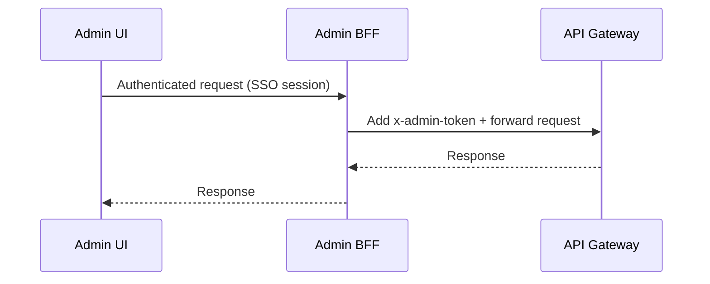

# Frontend Admin Access Model

Status: evidence-based current state plus PROPOSED safe models.

## 1) Evidence: Current admin auth model
- Admin routes require `x-admin-token` and scope `admin:write`. Source: `kyc-infra-main/cdktf/src/backend/controller/context.ts:63` and `kyc-infra-main/cdktf/src/backend/controller/context.ts:96`.
- CloudFront forwards `x-admin-token` header. Source: `kyc-infra-main/cdktf/src/constructs/edge/index.ts:57`.
- Optional WAF IP allowlist for admin routes (if CIDRs configured). Source: `kyc-infra-main/cdktf/src/constructs/edge/index.ts:100`.

SECURITY REQUIREMENT: Browser apps must not embed long-lived admin tokens or secrets.

## 2) Risks of current model
- `ADMIN_TOKEN` is a static secret (env). If exposed in a browser app, it is compromised.
- Admin actions include sensitive operations (tenant creation, risk override, billing overrides). Source: `kyc-infra-main/cdktf/src/backend/controller/index.ts:227`.

## 3) PROPOSED safe models

### Model A: Internal SSO + BFF (recommended)
- Admin UI authenticates via SSO (IdP).
- A backend-for-frontend (BFF) issues short-lived sessions and injects `x-admin-token` server-side.
- Admin UI never sees `ADMIN_TOKEN`.
- Acceptance criteria:
  - Admin UI can perform existing admin routes without exposing secrets.
  - BFF enforces RBAC and logs admin activity.

Mermaid sequence (PROPOSED):

### Model B: Internal gateway
- Admin UI talks to an internal gateway within a trusted network.
- Gateway adds `x-admin-token` and enforces IP allowlist.
- Requires strict network controls and audit logs.

## 4) Migration steps (PROPOSED)
1) Implement BFF service or internal gateway.
2) Update admin console to target the BFF/gateway instead of API Gateway directly.
3) Rotate and lock down `ADMIN_TOKEN` in environment.
4) Add audit logs for admin access and BFF sessions.

DECISION NEEDED: Select an admin access model and implement the supporting service.
