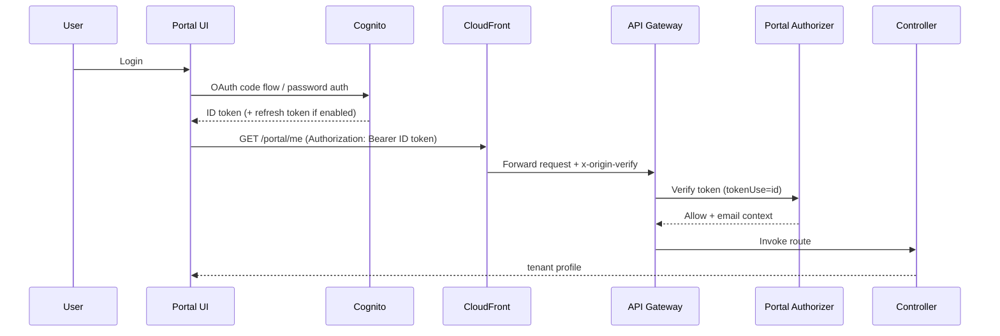
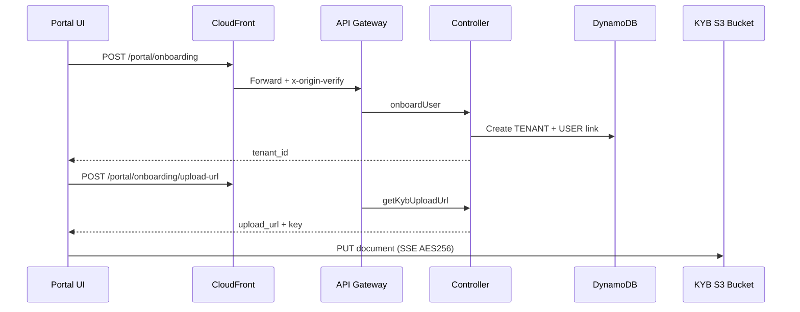
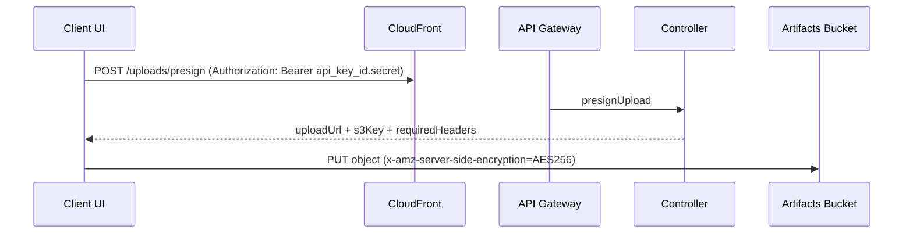
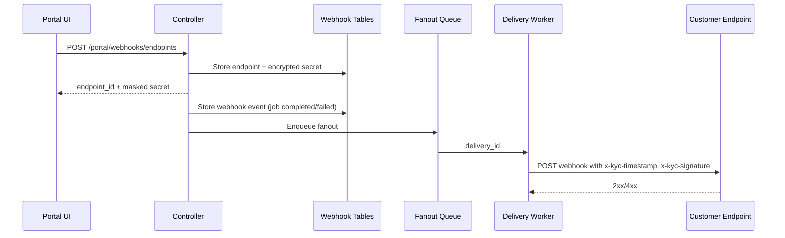
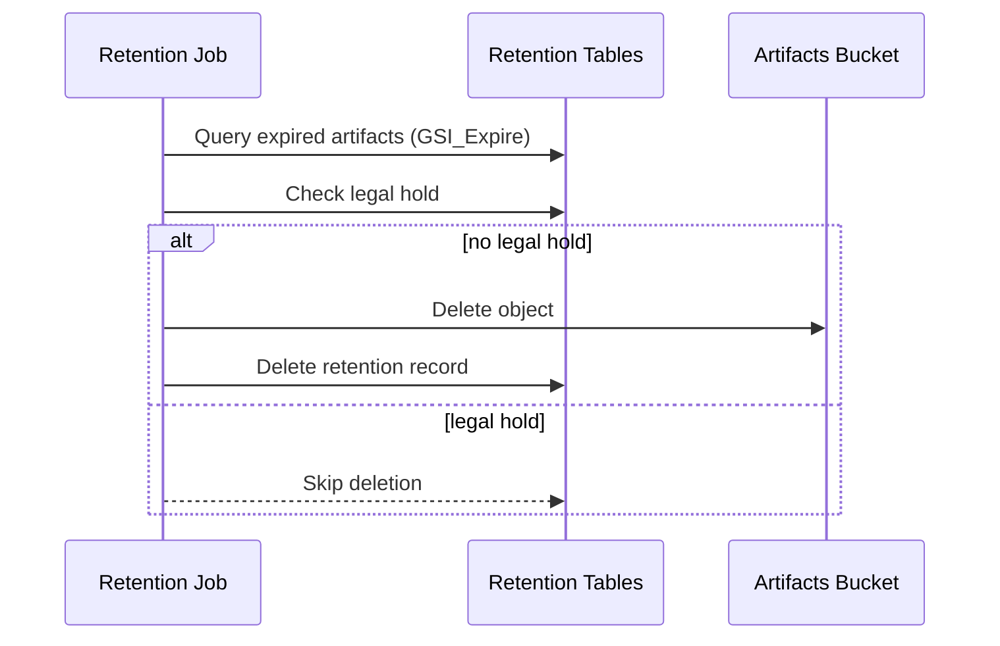

# Frontend Sequence Diagrams

Status: evidence-based; proposed steps marked.

## Table of Contents
1. Login and Token Validation
2. Portal Onboarding and KYB Upload
3. Presigned Upload Flow (Data Plane)
4. Webhook Registration and Delivery
5. Retention Deletion and Legal Hold

---

## 1. Login and Token Validation

Evidence: `kyc-infra-main/cdktf/src/backend/auth/portal-authorizer.ts:12`, `kyc-infra-main/cdktf/src/constructs/edge/index.ts:174`.

---

## 2. Portal Onboarding and KYB Upload

Evidence: `kyc-infra-main/cdktf/src/backend/controller/routes/onboarding.ts:15`.

---

## 3. Presigned Upload Flow (Data Plane)

Evidence: `kyc-infra-main/cdktf/src/backend/controller/routes/jobs.ts:242`.

---

## 4. Webhook Registration and Delivery

Evidence: `kyc-infra-main/cdktf/src/backend/webhooks/delivery-worker.ts:366`.

---

## 5. Retention Deletion and Legal Hold

Evidence: `kyc-infra-main/cdktf/src/backend/retention/job.ts:104`.
